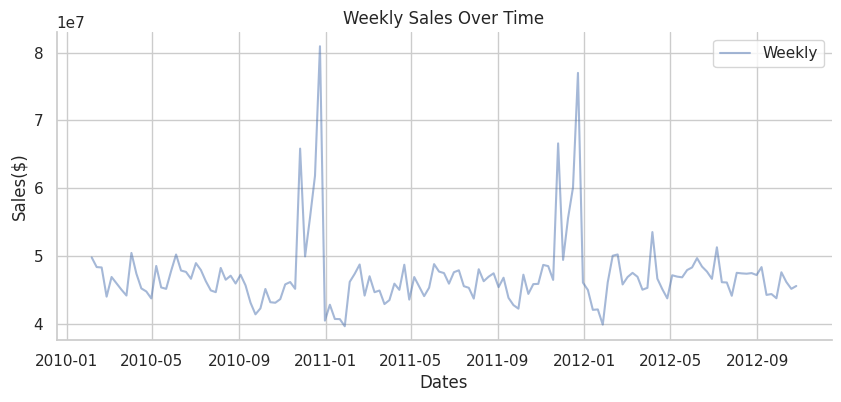
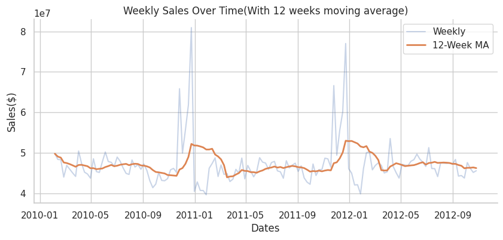
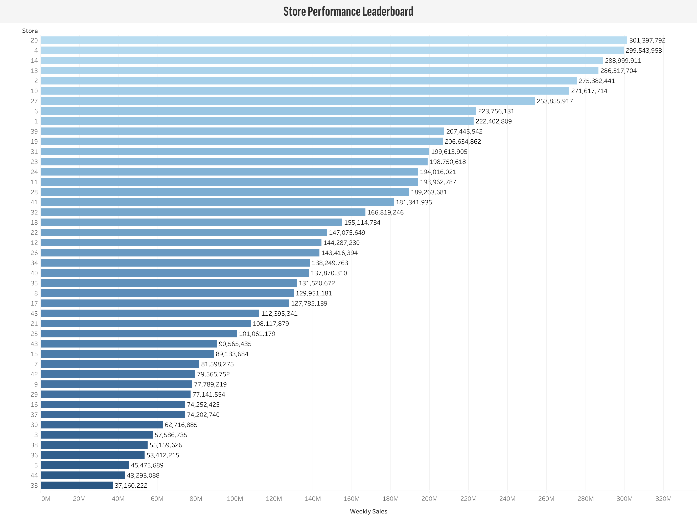
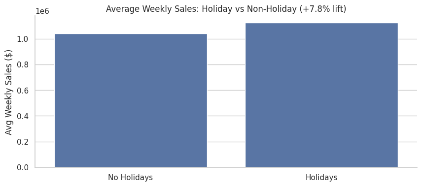
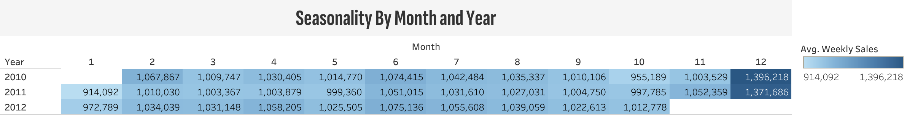
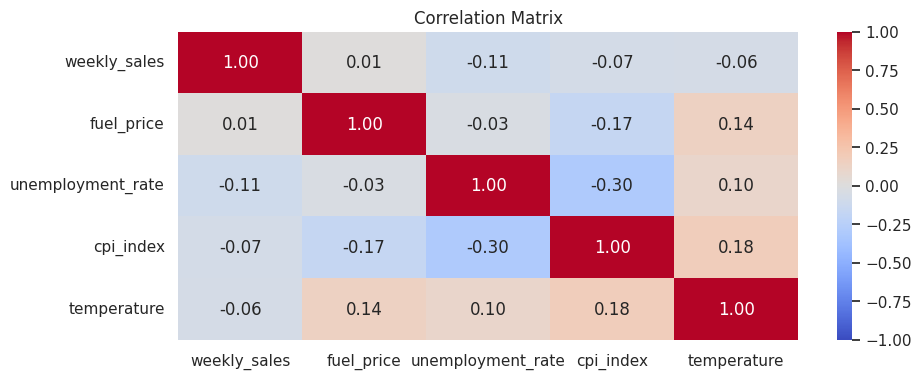
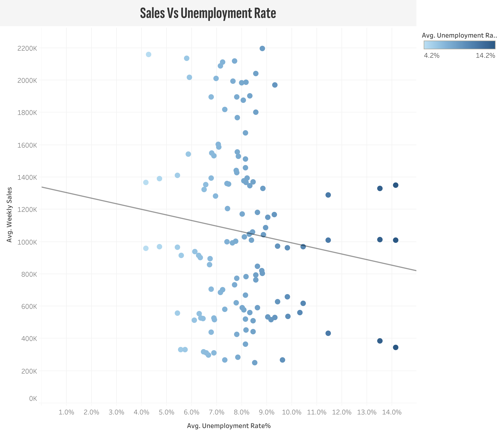
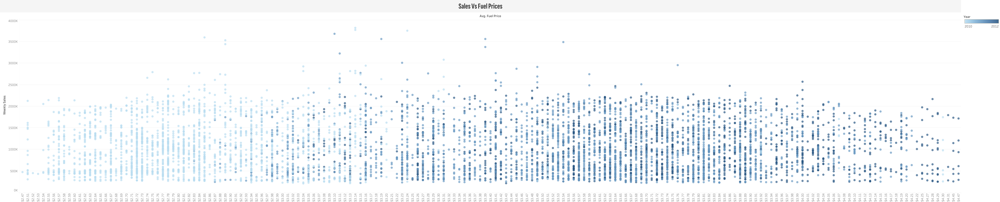

# Walmart Sales Forecasting Report  

**Tools Used:** Excel · SQL (BigQuery) · Python (Pandas, Matplotlib, Seaborn, Statsmodels) · Tableau  

**Project Type:** Data Cleaning · Exploratory Data Analysis · Data Visualization  

**Relevant Link: [GitHub Repository](https://github.com/Edwardnam/Walmart-Sales-Forecasting)**

  
  
  
  
  
  
  
  

---

## Table of Contents  

- [Project Background](#project-background)  
- [Executive Summary](#executive-summary)  
- [Dataset Schema](#dataset-schema)  
- [Insights Deep-Dive](#insights-deep-dive)  
  - [Sales Trends and Growth Rates](#1-sales-trends-and-growth-rates)  
  - [Store Performance Leaderboard](#2-store-performance-leaderboard)  
  - [Holiday Impact](#3-holiday-impact)  
  - [Seasonality by Month and Year](#4-seasonality-by-month-and-year)  
  - [Correlation & Macroeconomic Drivers](#5-correlation--macroeconomic-drivers)  
  - [Additional Pivot Table Summaries](#6-additional-pivot-table-summaries)  
- [Dashboard (Tableau)](#dashboard-tableau)  
- [Recommendations](#recommendations)  
- [Clarifying Questions, Assumptions, and Caveats](#clarifying-questions-assumptions-and-caveats)  
- [About](#about)  

---

## Project Background  

Walmart, one of the largest U.S. retailers, wants to better understand drivers of weekly sales across its stores. This project analyzes **6,445 store-weeks (2010–2012)**, combining macroeconomic indicators such as fuel prices, CPI index, unemployment rates, and holiday flags.  

The objective is to:  
- Identify patterns in sales across time, stores, and external conditions.  
- Quantify the impact of holidays, seasonality, and macroeconomics.  
- Provide actionable insights to help management **improve forecasting and decision-making**.  

---

## Executive Summary  

- Walmart’s dataset spans **45 stores, 2010–2012**, with **$584M total sales**.  
- **Average weekly sales ≈ $999K per store**.  
- **Holidays provide a +7.8% lift**, with sales spikes particularly visible in November and December.  
- **Store inequality**: Top 10 stores account for more than **35% of total sales**, suggesting different performance tiers.  
- **Macroeconomic sensitivity is limited** (fuel, unemployment, CPI correlations are weak), indicating demand is driven by **seasonality and holiday behavior** more than external shocks.  
- Insights support a **holiday-optimized inventory strategy** and a **store-tiered benchmarking system**.  

---

## Dataset Schema  

### Dataset Meta  

| Metric | Value |  
|---|---|  
| **Rows** | 6,445 (after cleaning) |  
| **Stores** | 45 |  
| **Date range** | 2010-02 to 2012-10 (weekly) |  
| **Target KPI** | `weekly_sales` (USD) |  

**Table Schema (SQL Extract)**  

| Column             | Data Type  | Description                               |  
|--------------------|------------|-------------------------------------------|  
| store              | INT64      | Store ID (1–45)                           |  
| date               | DATE       | Week start date                           |  
| weekly_sales       | FLOAT64    | Total weekly sales per store              |  
| holidays_flag      | STRING     | Holiday indicator (Holiday / No Holiday)  |  
| temperature        | FLOAT64    | Average weekly temperature (°F)           |  
| fuel_price         | FLOAT64    | Fuel price per gallon ($)                 |  
| cpi_index          | FLOAT64    | Consumer Price Index                      |  
| unemployment_rate  | FLOAT64    | Local unemployment rate (%)               |  
| year               | INT64      | Year extracted from date                  |  
| month              | INT64      | Month extracted from date                 |  

---

## Insights Deep-Dive  

### 1. Sales Trends and Growth Rates  

- Sales show strong **seasonal spikes**, especially in **November and December** (holiday shopping).  
- **12-week rolling averages** confirm sustained upward trends around holidays and volatility in summer months.  
- From 2010 to 2012, Walmart maintained **stable annual sales**, though 2012 shows slight declines in growth compared to prior years.  

📊 *Charts (Python)*:  
-   
-   

---

### 2. Store Performance Leaderboard  

- **Top store (Store 10)** generated **$271M total sales**, while the lowest-performing store managed only **$120M–$140M**.  
- Clear evidence of **tiered performance clusters**:  
  - Tier 1: $200M+ stores (flagship/high-traffic).  
  - Tier 2: $160M–$200M (average).  
  - Tier 3: <$150M (lagging).  
- This suggests **benchmarking opportunities**: lagging stores could learn from operational best practices of Tier 1 stores.  

📊 *Chart (Tableau)*:  
-   

---

### 3. Holiday Impact  

- **Holiday lift = +7.8%**, statistically significant (t-test p < 0.05).  
- Average weekly sales:  
  - Holidays: ~$1.07M  
  - Non-Holidays: ~$995K  
- Indicates holidays are a **reliable demand accelerator** and should drive inventory & marketing strategy.  

📊 *Charts (Python + Tableau)*:  
-   

---

### 4. Seasonality by Month and Year  

- Peak: **December (holiday season)** with average weekly sales >$1.25M.  
- Troughs: **February & July** with dips to ~$950K.  
- Seasonality is consistent across 2010–2012, confirming **predictability of holiday cycles**.  

📊 *Charts (Python + Tableau)*:  
-   

---

### 5. Correlation & Macroeconomic Drivers  

- **Correlation Matrix Findings**:  
  - Fuel price vs. sales → –0.01 (negligible).  
  - Unemployment rate vs. sales → –0.11 (mildly negative).  
  - CPI vs. sales → –0.07 (weakly negative).  
- Visual LOWESS regression confirms **minimal slope effects**.  
- Key takeaway: **Holidays and internal cycles matter far more than external economics**.  

📊 *Charts (Python)*:  
-   
-   
-   

---

### 6. Additional Pivot Table Summaries  

#### a) Sales by Year  

| Year | Total Sales | Avg Weekly Sales | Growth vs Prior Year |  
|------|-------------|------------------|----------------------|  
| 2010 | $200M+      | ~$980K           | – |  
| 2011 | $210M+      | ~$1.01M          | +3–4% |  
| 2012 | $175M+      | ~$975K           | –8–10% |  

➡ **Observation**: Growth peaked in 2011 but declined in 2012, likely due to post-recession stabilization.  

---

#### b) Average Weekly Sales by Store Tier  

| Store Tier | Definition            | Avg Weekly Sales | Key Insight |  
|------------|-----------------------|------------------|-------------|  
| Tier 1     | >$200M lifetime sales | $1.15M           | High-traffic, resilient |  
| Tier 2     | $160M–$200M           | ~$1.0M           | Average performers |  
| Tier 3     | <$150M                | $850K–$900K      | Turnaround targets |  

---

## Dashboard (Tableau)  

The Tableau dashboard consolidates KPIs and visuals:  

- **Filters**: Date Range, Holiday Flag  
- **KPI Cards**: Total Sales ($584M), Avg Sales ($999K), Holiday Impact (+7.8%)  
- **Charts**:  
  - Weekly Sales Over Time (line)  
  - Store Performance Leaderboard (bar)  
  - Sales vs Unemployment (scatter + trend)  
  - Seasonality by Month-Year (heatmap)  
  - Sales vs Fuel Prices (scatter)  

📊 *Screenshot (Tableau)*:  
-   

---

## Recommendations  

1. **Holiday Optimization**: Expand stock and marketing around November–December to leverage +7.8% lift.  
2. **Tier-Based Benchmarking**: Use Tier 1 stores as models; audit Tier 3 stores for underperformance causes.  
3. **Forecasting Models**: Deploy time-series models (ARIMA, Prophet) with holiday dummies for more accurate planning.  
4. **Macro Monitoring**: Continue tracking CPI/unemployment, but prioritize internal drivers over external economics.  
5. **Scenario Planning**: Test inventory strategies against both baseline and holiday-lift scenarios.  

---

## Clarifying Questions, Assumptions, and Caveats  

- Store metadata (region, size, demographics) is missing, limiting deeper segmentation.  
- `holidays_flag` is binary and does not distinguish specific holiday types.  
- Data ends in Oct 2012 → limits post-2012 trend visibility.  

---

## About  

This project demonstrates a **full-stack data workflow**:  

- **Excel** → Cleaning, pivot tables, preliminary metrics  
- **SQL (BigQuery)** → Aggregations, schema extraction, validation  
- **Python** → Time series, correlation, significance testing, visualizations  
- **Tableau** → Final dashboard for stakeholders  

For more projects and my data journey, visit my [Portfolio](#).  
