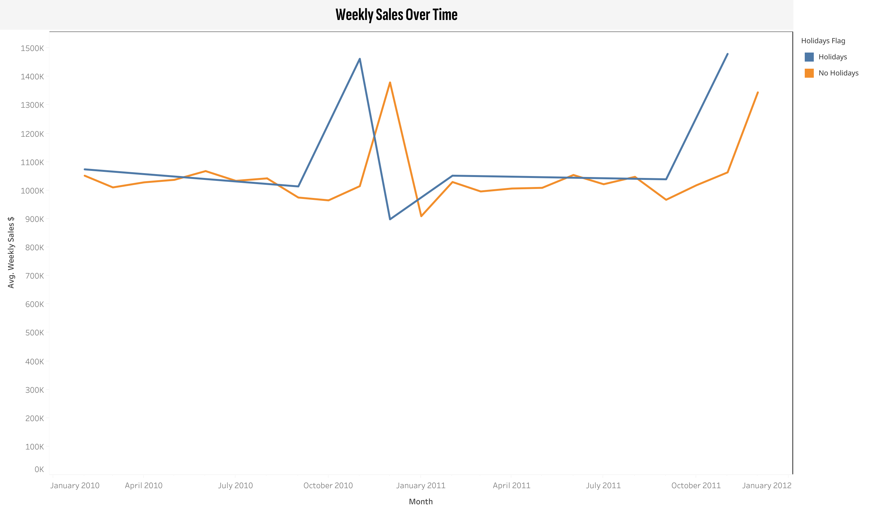
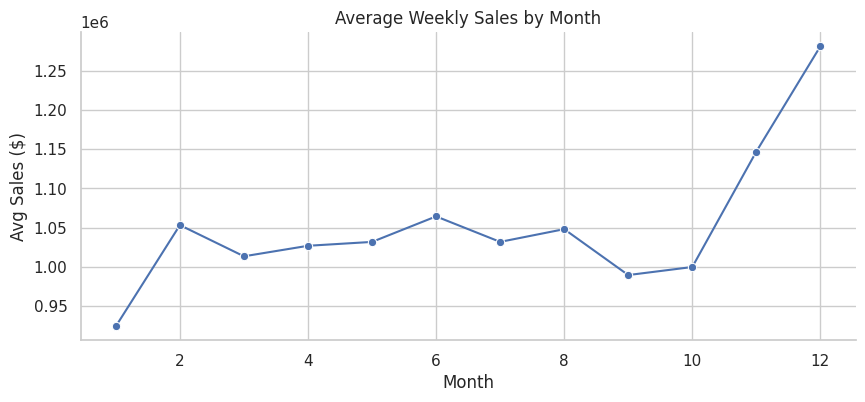
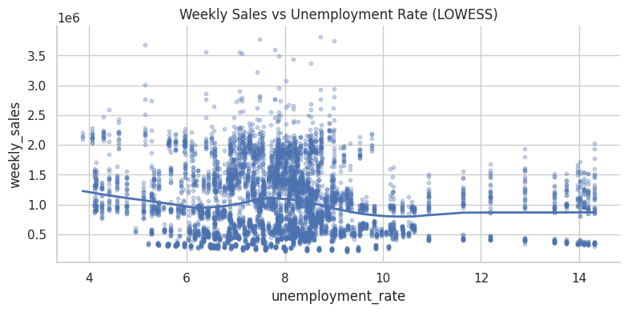
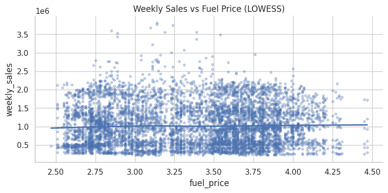
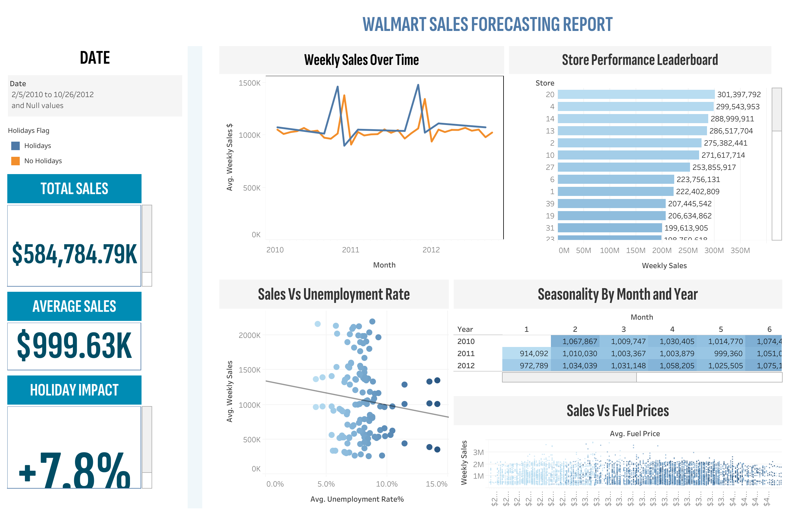

# Walmart Sales Forecasting Report  

**Tools Used:** Excel · SQL (BigQuery) · Python (Pandas, Matplotlib, Seaborn, Statsmodels) · Tableau  

**Project Type:** Data Cleaning · Exploratory Data Analysis · Data Visualization  

**Relevant Link: [GitHub Repository](https://github.com/Edwardnam/Walmart-Sales-Forecasting)**

---

## Table of Contents  

- [Project Background](#project-background)  
- [Executive Summary](#executive-summary)  
- [Dataset Schema](#dataset-schema)  
- [Insights Deep-Dive](#insights-deep-dive)  
  - [Sales Trends and Growth Rates](#1-sales-trends-and-growth-rates)  
  - [Store Performance Leaderboard](#2-store-performance-leaderboard)  
  - [Holiday Impact](#3-holiday-impact)  
  - [Seasonality by Month and Year](#4-seasonality-by-month-and-year)  
  - [Correlation & Macroeconomic Drivers](#5-correlation--macroeconomic-drivers)  
  - [Additional Pivot Table Summaries](#6-additional-pivot-table-summaries)  
- [Dashboard (Tableau)](#dashboard-tableau)  
- [Recommendations](#recommendations)  
- [Clarifying Questions, Assumptions, and Caveats](#clarifying-questions-assumptions-and-caveats)  
- [About](#about)  

---

## Project Background  

Walmart, one of the largest U.S. retailers, wants to better understand drivers of weekly sales across its stores. This project analyzes **6,445 store-weeks (2010–2012)**, combining macroeconomic indicators such as fuel prices, CPI index, unemployment rates, and holiday flags.  

The objective is to:  
- Identify patterns in sales across time, stores, and external conditions.  
- Quantify the impact of holidays, seasonality, and macroeconomics.  
- Provide actionable insights to help management **improve forecasting and decision-making**.  

---

## Executive Summary  

- **Scale & window:** 45 stores, 2010–2012; **6,445** weekly observations after cleaning.  
- **Topline:** **$584M** total sales; **~$999K** average weekly sales per store.  
- **Growth pattern:** 2011 up **~3–4%** vs. 2010; 2012 down **~8–10%** vs. 2011 (post-recession normalization).  
- **Holidays:** Consistent **+7.8%** lift on holiday weeks, peaking in **Nov–Dec**; effect is durable across years.  
- **Store inequality:** Top 10 stores contribute **35%+** of sales → clear **Tier 1/2/3** segmentation with persistent gaps.  
- **Macro sensitivity:** Fuel, CPI, unemployment show **weak** relationships with weekly sales (|r| < 0.12).  
- **So what for leaders:** Lean into **seasonality + holiday programs** and **tiered playbooks**; forecasting should prioritize **calendar features** and **store effects** over macro noise.

---

## Dataset Schema  

### Dataset Meta  

| Metric | Value |  
|---|---|  
| **Rows** | 6,445 (after cleaning) |  
| **Stores** | 45 |  
| **Date range** | 2010-02 to 2012-10 (weekly) |  
| **Target KPI** | `weekly_sales` (USD) |  

**Table Schema (SQL Extract)**  

| Column             | Data Type  | Description                               |  
|--------------------|------------|-------------------------------------------|  
| store              | INT64      | Store ID (1–45)                           |  
| date               | DATE       | Week start date                           |  
| weekly_sales       | FLOAT64    | Total weekly sales per store              |  
| holidays_flag      | STRING     | Holiday indicator (Holiday / No Holiday)  |  
| temperature        | FLOAT64    | Average weekly temperature (°F)           |  
| fuel_price         | FLOAT64    | Fuel price per gallon ($)                 |  
| cpi_index          | FLOAT64    | Consumer Price Index                      |  
| unemployment_rate  | FLOAT64    | Local unemployment rate (%)               |  
| year               | INT64      | Year extracted from date                  |  
| month              | INT64      | Month extracted from date                 |  

---

## Insights Deep-Dive  

### 1. Sales Trends and Growth Rates  

- Weekly trend shows **predictable seasonal spikes** around the U.S. holiday calendar; troughs cluster in **Feb/Jul**.  
- **12-week rolling averages** highlight sustained Q4 momentum and short summer volatility.  
- 2010→2011 growth broad-based; **2012 softness** appears across most stores—normalization rather than shock.  

📊 *Charts (Python)*:  
-   
-   

**Why this matters:** Demand is **rhythmic and forecastable**. Planning should be anchored to **calendar features** (week-of-year, holiday dummies) and **store effects**, not short-term headlines.

---

### 2. Store Performance Leaderboard  

- **Top store (Store 10)** generated **$271M** total; the lowest tier ranges **$120–$140M**.  
- Clear **tiering**:  
  - **Tier 1:** >$200M lifetime — high traffic + strong execution.  
  - **Tier 2:** $160–$200M — solid base.  
  - **Tier 3:** <$150M — lagging; likely fixable execution gaps.  

📊 *Chart (Tableau)*:  
-   

**Why this matters:** A single national playbook **over-serves** some stores and **under-serves** others. **Tier-specific targets** and diagnostics (OOS%, price gaps, labor coverage, floor-set compliance) are required.

---

### 3. Holiday Impact  

- **Average lift = +7.8%** (t-test p < 0.05). Typical week **~$995K** → holiday week **~$1.07M**.  
- Effect is **repeatable** across years, especially **Nov–Dec**.  

📊 *Charts (Python + Tableau)*:  
- 
- 

**Why this matters:** Holidays are **reliable profit pools**. Treat them as a **program** (forward buys, labor ramp, staged promos, attach bundles) rather than ad-hoc spikes.

---

### 4. Seasonality by Month and Year  

- Peak **December** average > **$1.25M**; troughs in **Feb/Jul** near **$950K**.  
- Heatmap and line views show **repeatable Q4 surges** with mild YoY variation.  

📊 *Charts (Python + Tableau)*:  
- 
- 

**Why this matters:** Including **month + week-of-year + holiday dummies** will materially reduce **forecast error (MAPE)**, improving inventory and labor placement.

---

### 5. Correlation & Macroeconomic Drivers  

- **Correlation Matrix Findings:**  
  - Fuel price vs. sales → −0.01 (negligible).  
  - Unemployment vs. sales → −0.11 (weak negative).  
  - CPI vs. sales → −0.07 (weak negative).  
- LOWESS lines show **minimal slopes** → macros **nudge** but don’t **drive** weekly swings.  

📊 *Charts (Python)*:  
- 
- 
- 

**Why this matters:** Prioritize **internal levers** (assortment, promos, ops) for weekly planning. Use macro only for **scenario stress-tests** (risk sizing), not as primary steering signals.

---

### 6. Additional Pivot Table Summaries  

#### a) Sales by Year  

| Year | Total Sales | Avg Weekly Sales | Growth vs Prior Year |  
|------|-------------|------------------|----------------------|  
| 2010 | $200M+      | ~$980K           | – |  
| 2011 | $210M+      | ~$1.01M          | +3–4% |  
| 2012 | $175M+      | ~$975K           | –8–10% |  

➡ **Observation:** 2011 momentum cooled in 2012—consistent with demand normalization rather than operational issues.

#### b) Average Weekly Sales by Store Tier  

| Store Tier | Definition            | Avg Weekly Sales | Key Insight |  
|------------|-----------------------|------------------|-------------|  
| Tier 1     | >$200M lifetime sales | $1.15M           | Protect velocity (availability, attach, queue-busting) |  
| Tier 2     | $160–$200M           | ~$1.0M           | Lift conversion (endcap discipline, local promos) |  
| Tier 3     | <$150M                | $0.85–$0.90M     | Turnaround kit (OOS audit, price gaps, floor-set fixes) |

---

## Dashboard (Tableau)  

The Tableau dashboard consolidates KPIs and visuals:  

- **Filters**: Date Range, Holiday Flag  
- **KPI Cards**: Total Sales ($584M), Avg Sales ($999K), Holiday Impact (+7.8%)  
- **Charts**:  
  - Weekly Sales Over Time (line)  
  - Store Performance Leaderboard (bar)  
  - Sales vs Unemployment (scatter + trend)  
  - Seasonality by Month-Year (heatmap)  
  - Sales vs Fuel Prices (scatter)  

📊 *Screenshot (Tableau)*:  
- 

---

## Recommendations  

1. **Holiday Optimization**  
   - **Why it matters:** Holidays reliably add **+7.8%**; most upside is operational (stock, labor, attach) rather than discounting.  
   - **Do this:** Pull Q4 POs forward **2–4 weeks**; aim **>98%** in-stock on A-SKUs. Run **staged promos** (warm-up → event → last-mile). Pre-build endcaps; push **giftable bundles** to lift basket size.

2. **Tier-Based Benchmarking**  
   - **Why it matters:** Top stores drive **35%+** of revenue; Tier 3 gaps are often fixable.  
   - **Do this:**  
     - **Tier 1:** Protect velocity—labor guardrails, fast checkout, attach targets.  
     - **Tier 2:** Improve conversion—floor-set discipline, localized promos, ticket boosters.  
     - **Tier 3:** Run a **turnaround kit** (OOS audit, price gap check, floor-set correction) and track lift.

3. **Forecasting Models**  
   - **Why it matters:** Seasonality + holidays explain most variance; modeling them reduces **stockouts/overstock**.  
   - **Do this:** Use **Prophet/ARIMA** with **yearly seasonality + holiday dummies + store fixed effects + week-of-year + lags**. Retrain monthly; re-forecast weekly in Q4. Publish **MAPE by store** to guide ops focus.

4. **Pricing & Promo Hygiene**  
   - **Why it matters:** Q4 traffic is naturally high; blanket markdowns risk **trading margin for non-incremental units**.  
   - **Do this:** Use **price fences** (bundles, membership, time-boxed offers). A/B test price bands in low-season months; lock **holiday pricing** ahead of peak.

5. **Last-Mile & CRM Alignment**  
   - **Why it matters:** Late-season conversion hinges on **convenience** and **message timing**.  
   - **Do this:** Shift creative by phase (discovery → urgency → convenience/BOPIS). Coordinate store pickup capacity and SLA; monitor **BOPIS share** and conversion.

---

## Clarifying Questions, Assumptions, and Caveats  

- Store metadata (region, size, format) is missing, limiting deeper segmentation and explaining tier gaps.  
- `holidays_flag` is binary; splitting by **holiday type** would improve attribution (e.g., Black Friday vs. Christmas).  
- Data ends in Oct 2012 → conclusions focus on **in-sample patterns**; external validity should be re-checked with new data.  

---

## About  

This project demonstrates a **full-stack data workflow**:  

- **Excel** → Cleaning, pivot tables, preliminary metrics  
- **SQL (BigQuery)** → Aggregations, schema extraction, validation  
- **Python** → Time series, correlation, significance testing, visualizations  
- **Tableau** → Final dashboard for stakeholders  

For more projects and my data journey, visit my **[LinkedIn](https://www.linkedin.com/in/nam-ngo-b48780206/)**.  
